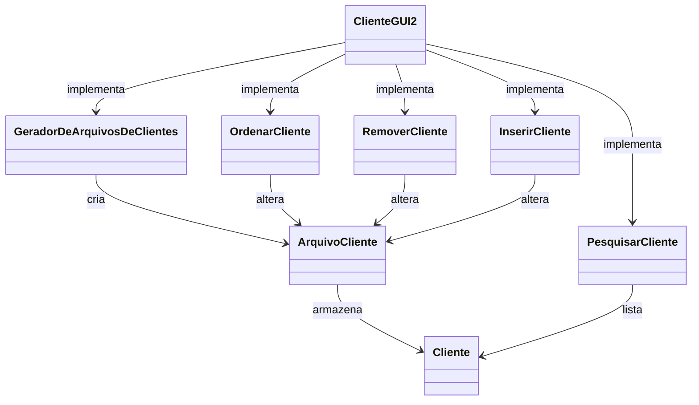

# Trabalho Prático 2 - Sistema de Gerenciamento de Cliente

_Disciplina de **Técnicas de Programação Avançada**, ministrada pelo Professor [Mateus Conrad B. da Costa](https://github.com/mbarcosta) no curso de Bacharelado em Sistemas de Informação do Instituto Federal do Espírito Santo_.

---

### Equipe

- João Pedro Pagotto da Costa - [@JoaoPPagotto](https://github.com/JoaoPPagotto)

## Descrição do Problema

### Contextualização

O problema que este trabalho busca resolver é a **gestão eficiente de grandes volumes de dados** relacionados aos clientes de uma empresa fictícia. Em um cenário onde a empresa possui mil, milhares ou milhões de clientes cadastrados, a necessidade de armazenar, processar e acessar rapidamente essas informações se torna um desafio.

Assim, como os dados são armazenados, manipulados e acessados é crucial para garantir que o sistema seja escalável e eficiente, principalmente quando se trata de grandes arquivos de clientes, que não podem ser completamente carregados na memória devido à limitação de recursos.

### Objetivo do Trabalho

O objetivo deste trabalho é implementar um sistema de gerenciamento de clientes que possibilite realizar as operações básicas de forma eficiente, mesmo com grandes volumes de dados. O sistema deverá ser capaz de:

- **Listar clientes em ordem alfabética:** Usando um algoritmo de ordenação externa, o sistema deve ordenar os dados dos clientes de maneira eficiente e exibi-los ao usuário.

- **Pesquisar clientes:** O sistema deve permitir a pesquisa rápida de clientes com base em nomes ou sobrenomes.

- **Inserir novos clientes:** O sistema deve ser capaz de adicionar novos clientes à base de dados, garantindo que a ordem dos registros seja mantida conforme a ordenação.

- **Remover clientes:** O sistema deve permitir a remoção de registros de clientes de maneira eficiente, ajustando os dados conforme necessário.

A implementação incluirá uma interface gráfica baseada em JFrame, que proporcionará ao usuário uma maneira intuitiva de interagir com o sistema. A interface gráfica também será otimizada para carregar registros de clientes em lotes, minimizando o uso de memória durante a exibição dos dados.

---

## Arquitetura da Aplicação com Diagrama de Classes



# Descrição da Arquitetura

A arquitetura do sistema está estruturada em quatro camadas principais, cada uma com responsabilidades específicas para facilitar a organização e o funcionamento do sistema:

## Camada de Interfaces (Interfaces)
- **ArquivoSequencial**: Fornece uma interface para a manipulação de arquivos sequenciais, possibilitando operações de leitura e escrita de dados.
- **Buffer**: Define a interface para gerenciar buffers, oferecendo uma abstração para o armazenamento e manipulação temporária dos dados de clientes.

## Camada de Modelos (Models)
- **ArquivoCliente**: Representa os arquivos onde os dados dos clientes estão armazenados. É responsável por realizar operações de leitura e gravação no sistema de arquivos.
- **BufferDeClientes**: Implementa a funcionalidade de buffer, armazenando temporariamente os registros de clientes e fornecendo acesso eficiente ao sistema.
- **Cliente**: Modelo que encapsula as informações de um cliente, incluindo atributos como nome, telefone, endereço, entre outros dados relevantes.

## Camada de Utilitários (Utils)
- **GeradorDeArquivosDeClientes**: Gera dados fictícios de clientes em larga escala, criando arquivos úteis para testes ou para preencher o sistema com informações simuladas.
- **OrdenarCliente**: Responsável pela ordenação dos registros de clientes, permitindo que os dados sejam organizados em ordem alfabética.

## Camada de Visualização (Views)
- **ClienteGUI2**: A interface gráfica principal do sistema, que permite aos usuários visualizar, gerenciar e modificar os dados dos clientes.
- **InserirCliente**: Fornece uma interface dedicada para a adição de novos clientes ao sistema.
- **PesquisarCliente**: Permite que os usuários realizem buscas nos registros existentes para localizar clientes específicos.
- **RemoverCliente**: Oferece uma interface para a exclusão de clientes, com ferramentas para gerenciar a remoção segura dos registros no sistema.

Essa estrutura modular garante a separação de responsabilidades e facilita a manutenção e expansão do sistema ao longo do tempo.

---

# Descrição dos Principais Algoritmos Utilizados

## Ordenação Externa com Merge Sort (External Merge Sort)

O algoritmo empregado na classe **OrdenarCliente** é uma versão do Merge Sort adaptada para ordenação externa. Esse método é ideal para lidar com grandes volumes de dados que excedem a capacidade de memória principal (RAM). Ele funciona em duas etapas principais: a criação de partes menores (chunks) ordenadas e, posteriormente, a fusão dessas partes para gerar um arquivo final ordenado.

### Etapa 1: Divisão dos Dados em Partes Ordenadas (Chunks)
Nesta etapa, o algoritmo divide os dados em blocos menores que podem ser carregados e ordenados na memória.

- **Leitura dos dados**: Os dados do arquivo de entrada são lidos em blocos de tamanho fixo, definidos pela constante `CHUNK_SIZE`.
- **Ordenação na memória**: Cada bloco lido é ordenado utilizando o método `Collections.sort()`, que internamente usa QuickSort ou Timsort, dependendo da implementação da JVM.
- **Gravação dos chunks**: Os blocos ordenados são gravados em arquivos temporários no disco.

#### Pseudocódigo da Etapa 1
```plaintext
Enquanto houver dados não processados:
   Ler um bloco de dados (tamanho CHUNK_SIZE)
   Ordenar o bloco na memória
   Gravar o bloco ordenado em um arquivo temporário
```

### Etapa 2: Mesclagem dos Chunks Ordenados
Após a criação dos arquivos temporários, ocorre a fusão dos chunks ordenados para produzir o arquivo final.

- **Abertura de streams**: Para cada arquivo temporário gerado, um `ObjectInputStream` é utilizado para leitura sequencial.
- **Fila de prioridade**: Uma `PriorityQueue` é usada para gerenciar os menores elementos de cada chunk, permitindo que os dados sejam escritos no arquivo final em ordem crescente.
- **Processo de mesclagem**: O menor elemento é retirado da fila, gravado no arquivo de saída, e o próximo elemento do mesmo chunk é adicionado à fila.

#### Pseudocódigo da Etapa 2
```plaintext
Criar uma fila de prioridade (PriorityQueue)

Para cada arquivo temporário:
    Ler o primeiro elemento e adicioná-lo à fila de prioridade

Enquanto a fila de prioridade não estiver vazia:
    Remover o menor elemento da fila
    Gravar o elemento no arquivo final ordenado
    Ler o próximo elemento do arquivo temporário correspondente e adicioná-lo à fila
```

### Estrutura da Fila de Prioridade (Priority Queue)
A fila de prioridade gerencia objetos do tipo `ClienteEntry`, que encapsulam o cliente e o índice do arquivo temporário de origem. A comparação entre os objetos é baseada no método `compareTo()` da classe **Cliente**, permitindo que a ordenação seja realizada por atributos como o nome ou qualquer outro critério especificado.

### Complexidade do Algoritmo

#### Criação dos Chunks
- **Leitura e gravação**: O(N), onde N é o número total de elementos.
- **Ordenação de cada chunk**: O(M log M), sendo M o tamanho do chunk.

#### Mesclagem dos Chunks
- **Inserção e remoção na fila de prioridade**: O(log K) para cada operação, onde K é o número de chunks.
- **Complexidade total da mesclagem**: O(N log K), considerando N elementos.

O algoritmo é eficiente para lidar com grandes volumes de dados, otimizando o uso da memória principal ao distribuir a carga para o disco.


---
## Pré-requisitos
Certifique-se de ter instalado as seguintes ferramentas:
- **Java Development Kit (JDK)** versão 8 ou superior. Você pode baixar a versão mais recente do JDK do [site oficial da Oracle](https://www.oracle.com/java/technologies/javase-jdk11-downloads.html).
- **Maven** (certifique-se de que o Maven foi adicionado ao PATH do seu sistema).

## **Passos para Compilação & Execução**

1. Clone o repositório do GitHub para sua máquina local utilizando o comando:
`git clone https://github.com/seu-usuario/nome-do-repositorio.git`

2. Navegue até o diretório do projeto e compile-o utilizando o comando: 
`mvn clean compile`

3. Execute o arquivo `ClienteGUI2.java`.

## Link para o Código-Fonte
O código-fonte completo da aplicação pode ser acessado em [https://github.com/JoaoPPagotto/gestao-de-clientes](https://github.com/JoaoPPagotto/gestao-de-clientes)

---
